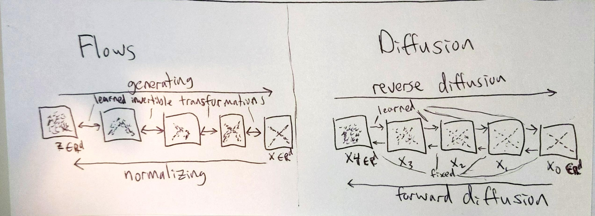
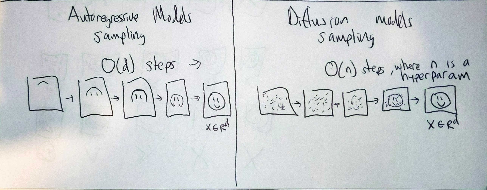

# Diffusion Models

Diffusion models are trained by adding noise to data in a multi-step process, and trying to reverse that noise with a neural network. 
Intuitively, learning to remove a small of noise at a time is easier than all at once.
These models have specific structures and training processes described by their probabilistic structure,
but they offer good flexibility in architectural choices for the denoising module.
They have recently been shown to be capable of producing high-quality samples and good log-likelihoods.

This implementation is based on [Denoising Diffusion Probabilistic Modeling (2020)](https://arxiv.org/pdf/2006.11239.pdf)
and [Improved Denoising Diffusion Probabilistic Modeling (2021)](https://arxiv.org/pdf/2102.09672.pdf), which build off
[Deep Unsupervised Learning using Nonequilibrium Thermodynamics (2015)](https://arxiv.org/pdf/1503.03585.pdf).

I started from the code here: https://github.com/openai/improved-diffusion,
then greatly simplified it by removing options and extra features, and made it work decently on MNIST.
While this makes things easier to understand, it has reduced the code flexibility and performance slightly.

The rest of this document contains analogies between diffusion models and other generative models, and
some definitions of terms that come up in the papers. This is probably a decent place to start, 
for later digging into the details of the papers.

**Contents**
- [Analogies with other generative models](#analogies-with-other-generative-models)
  - [Flows](#flows)
  - [VAEs](#vaes)
  - [Autoregressive models](#autoregressive-models)
- [Terminology](#terminology)
  - [What is "diffusion"?](#what-is-diffusion)
  - [What is "score matching"?](#what-is-score-matching)
  - [What is "Langevin dynamics"?](#what-is-langevin-dynamics)
- [Changes that Improved DDPMs introduces:](#changes-that-improved-ddpms-introduces)
- [Related papers](#related-papers)

## Analogies with other generative models
### Flows
<!--

TODO: once I can sample from flows and diffusion models, I should make this diagram with
real images. Drawing something to approximate them is not great. It could be a placeholder, better than nothing...

-->

Diffusion models sort of look like flows. During sampling, you start with noise () that is the same dimensionality of the image ()
and you pass it through several processing layers to gradually convert from noise to image.
Unlike flows, diffusion models are not directly transforming a distribution and are not constrained to bijective mappings.
The forward "normalizing" process consists of gradually adding small amounts of Gaussian noise until all signal is erased.
The reverse process uses a learned function to gradually remove Gaussian noise until a sample from the data distribution is produced. 

### VAEs

Diffusion models can be described by a directed graphical model and trained with a variational bound, like VAEs.
VAEs assume there are latent properties  which underly the data-generating process for .
The variational bound for VAEs looks like: 

Diffusion models instead assume a Markov chain process, whereby the latents
are the noisy intermediate versions of the data.
(You can imagine this corresponds to a physical diffusion process, where a gas
gradually diffuses in a room to reach a higher entropy state over time T.
Reversing this process would let you recover where the initial state of the particles.)
If we define a multi-step graphical model, with  as the latents,
the variational lower bound loosely resembles the VAE one:

<a href="https://www.codecogs.com/eqnedit.php?latex=L^{\text{Diffusion}}_{\text{VLB}}&space;=&space;\underbrace{-log&space;p_\theta(x_0|x_1)}_{\text{reconstruction}}&space;&plus;&space;\underbrace{\sum_{t=1}^{T}&space;KL(q(x_{t-1}|x_t,&space;x_0)&space;||&space;p_\theta(x_{t-1}|x_t))}_{\sim&space;\text{inject&space;noisy&space;information&space;from&space;$x_0$&space;to&space;train&space;$p_\theta$}}&space;&plus;&space;\underbrace{KL(q(x_T|x_0)&space;||&space;p(x_T))}_\text{negligible.&space;$q(x_T|x_0)$&space;is&space;pure&space;noise}" target="_blank"></a>

For diffusion models, we don't need to learn an approximate posterior  because we can compute it directly as a function of Gaussian noise applied to the data. It has the same direction as the forward process, except it gets to condition on . Minimizing the KL between these has the interpretation of injecting signal about  into .

### Autoregressive models

Diffusion models and autoregressive models share the notion of progressively producing a sample by running many forward
passes of the same network, and conditioning on prior generation.
However, diffusion models do not require you to define and respect an autoregressive ordering on the data.
The number of processing steps is not strictly dependent on the dimensionality of the data and can be chosen as a hyperparameter.
And during sampling, you can reduce the number of processing steps. 

## Terminology

### What is "diffusion"?

[Diffusion](https://en.wikipedia.org/wiki/Molecular_diffusion) is the physical process where particles in a system tend to spread out and equilibrate to a maximum entropy state.
One example is a concentrated gas gradually diffusing in a room over time. You may know the initial state of those
particles, but over time you gradually lose information about them. This is the forward diffusion process.

You can also imagine a reverse diffusion* process that removes noise from a system---that reduce it's entropy.
According to 2nd law of thermodynamics, it's impossible to reduce total entropy, in the universe or any closed system.
It is possible, however, to reduce entropy in one system by increasing it in another.
A physical example of such a reverse diffusion process is [reverse osmosis water treatment](https://youtu.be/4RDA_B_dRQ0).
Polluted water is higher entropy compared to clean water separated from pollutants.
To reverse this entropy, we have to expend energy to produce high-pressure gradients and drive the reverse osmosis process.

Forward diffusion happens naturally. Reverse diffusion requires external energy to be put in.
"Creating noise from data is easy; creating data from noise is generative modeling." - https://arxiv.org/abs/2011.13456.
In diffusion models, the forward diffusion process is Gaussian noise injection.
Reverse diffusion uses a learned network to denoise the data, which requires us to put in compute and inject knowledge from the data distribution.

(*I am not sure if this is a widely accepted definition of reverse diffusion. But this definition
corresponds mostly closely to "reverse diffusion" in these generative models.)

### What is "score matching"?

(See section 2 of this paper for more: http://dpkingma.com/files/kingma-lecun-nips-10.pdf)

If we define our data distribution as , then the score of that distribution is . In other words, the score is the slope of the data density function wrt to the data.

In likelihood-based approaches, we try to learn a function model  to match an underlying . This requires  to be properly normalized. In score matching, we instead try to learn a function to match the underlying score of the data distribution.
The score of a distribution is not directly accesible, but there are various ways to approximate it.
In this work, the reverse diffiusion process can be seen as such an approximation.

In general, score matching can be a nice way to avoid having to produce a normalized density function from a neural network,
since optimizing a function to match it does not require you to account for the normalization factor Z (it's drops out when you take the grad of the log).

### What is "Langevin dynamics"?

In this work, Langevin dynamics refers to the sampling process, whereby
you initialize noise and then run several steps of noisy SGD to generate an image.
The reverse diffusion process can be interpretted as learning the score function (slope of data density),
so this doesn't actually require any backpropagation.
(In contrast, [EBMs](https://openai.com/blog/energy-based-models/) sometimes use a similar sampling process, but they do require backprop to take samples)

## Changes that Improved DDPMs introduces:
- learning the variance, using the variational lower bound,  instead of just the epsilon difference.
- cosine scheduling so there is less noise throughout the process.
- skipping steps during sampling to make it faster.

## Related papers
- wavegrad
- song + ermon score matching, ddim.
