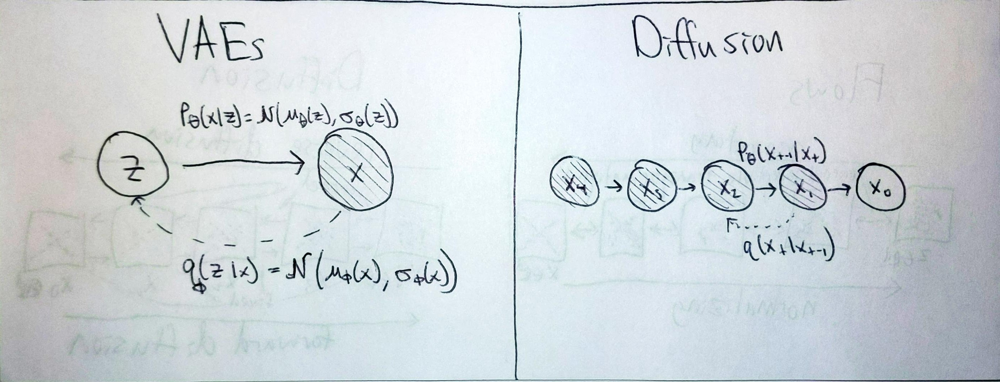

# Diffusion Models

Diffusion models are a type of generative models, trained by adding noise to data in
a multi-step process, and trying to reverse that noise with a neural network. 
Intuitively, learning to remove a small of noise at a time is easier than all at once.
These models have specific structures and training processes described by their probabilistic structure,
but they offer good flexibility in architectural choices for the denoising module.
They have recently emerged as an interesting type of generative model, capable of producing
high-quality samples and log-likelihoods.

This implementation is based on [Denoising Diffusion Probabilistic Modeling (2020)](https://arxiv.org/pdf/2006.11239.pdf)
and [Improved Denoising Diffusion Probabilistic Modeling (2021)](https://arxiv.org/pdf/2102.09672.pdf), which build off
[Deep Unsupervised Learning using Nonequilibrium Thermodynamics (2015)](https://arxiv.org/pdf/1503.03585.pdf).

For more in-depth description, and analogies between diffusion models and other generative models, see below.

**Contents**
- [Analogies with other generative models](#analogies-with-other-generative-models)
  - [Flows](#flows)
  - [VAEs](#vaes)
  - [Autoregressive models](#autoregressive-models)
- [Terminology](#terminology)
  - [What is "diffusion"?](#what-is-diffusion)
  - [What is "score matching"?](#what-is-score-matching)
  - [What is "Langevin dynamics"?](#what-is-langevin-dynamics)
  - [Next section](#next-section)
- [Changes that Improved DDPMs introduces:](#changes-that-improved-ddpms-introduces)
- [Related papers](#related-papers)

## Analogies with other generative models
### Flows
<!--

TODO: once I can sample from flows and diffusion models, I should make this diagram with
real images. Drawing something to approximate them is not great. It could be a placeholder, better than nothing...

-->

Diffusion models sort of look like flows. During sampling, you start with noise ($x_T$) that is the same dimensionality of the image ($x_0$)
and you pass it through several processing layers to gradually convert from noise to image.
Unlike flows, diffusion models are not transforming the noise distribution and thus are not constrained to bijective mappings.
The forward "normalizing" process consists of gradually adding small amounts of Gaussian noise until all signal is erased.
The reverse process uses a learned function to gradually remove Gaussian noise until a sample from the data distribution is produced. 
Diffusion models generally use the same denoising network over and over, but they will condition it on a time index.

### VAEs

Diffusion models can be described by a directed graphical model and trained with a variational bound, like VAEs.
VAEs assume there are latent properties $z$ which underly the data-generating process for $x$.
The variational bound for VAEs looks like: 
$$L^{\text{VAE}}_{\text{VLB}} = \underbrace{-log p_\theta(x|z)}_\text{reconstruction} + \underbrace{KL(q_\phi(z|x) || p(z))}_{\sim \text{regularize encoder, make it possible to sample z}}$$

Diffusion models instead assume a Markov chain process, whereby the latents
are the noisy intermediate versions of the data.
(You can imagine this corresponds to a physical diffusion process, where a gas
gradually diffuses in a room to reach a higher entropy state over time T.
Reversing this process would let you recover where the initial state of the particles.)
If we define a multi-step graphical model, with $x_{T}, x_{T-1}, ... x_{1}$ as the latents,
the variational lower bound loosely resembles the VAE one:
$$L^{\text{Diffusion}}_{\text{VLB}} = \underbrace{-log p_\theta(x_0|x_1)}_{\text{reconstruction}} + \underbrace{\sum_{t=1}^{T} KL(q(x_{t-1}|x_t, x_0) || p_\theta(x_{t-1}|x_t))}_{\sim \text{inject noisy information from $x_0$ to train $p_\theta$}} + \underbrace{KL(q(x_T|x_0) || p(x_T))}_\text{negligible. $q(x_T|x_0)$ is pure noise}$$

For diffusion models, we don't need to learn an approximate posterior $(q(x_{t-1}|x_t,x_0))$ because we can compute it directly as a function of Gaussian noise applied to the data. It has the same direction as the forward process, except it gets to condition on x0. Minimizing the KL between these has the interpretation of injecting signal about x0 into p_\theta.

### Autoregressive models

Diffusion models and autoregressive models share the notion of progressively producing a sample by running many forward
passes of the same network, and conditioning on prior generation.
However, diffusion models do not require you to define and respect an autoregressive ordering on the data.
The number of processing steps is not strictly dependent on the dimensionality of the data and can be chosen as a hyperparameter.
And during sampling, you can reduce the number of processing steps. 

### Energy-based models

Diffusion models are also similar to EBMs in a way.
To sample EBMs requires running a langevin dynamics process.
But this is better because it is learned and principled.

## Terminology

### What is "diffusion"?

[Diffusion](https://en.wikipedia.org/wiki/Molecular_diffusion) is the physical process where particles in a system tend to spread out and equilibrate to a maximum entropy state.
One example is a concentrated gas gradually diffusing in a room over time. You may know the initial state of those
particles, but over time you gradually lose information about them. This is the forward process.

You can also imagine a reverse diffusion* process that removes noise from a system---that reduce it's entropy.
According to 2nd law of thermodynamics, it's impossible to reduce total entropy, in the universe or any closed system.
It is possible, however, to reduce entropy in one system by increasing it in another.
A physical example of such a reverse diffusion process is [reverse osmosis water treatment](https://youtu.be/4RDA_B_dRQ0).
Polluted water is higher entropy compared to clean water separated from pollutants.
To reverse this entropy, we have to expend energy to produce high-pressure gradients to drive the reverse osmosis process.

Forward diffusion happens naturally. Reverse diffusion requires external energy to be put in.
"Creating noise from data is easy; creating data from noise is generative modeling." - https://arxiv.org/abs/2011.13456.

In diffusion models, the forward diffusion is Gaussian noise injection.
To do reverse diffusion, we have to spend irreversible compute power to train a network capable of taking
noise and producing clean samples from the data distribution.

*I am not sure if this is a widely accepted definition of reverse diffusion. But it corresponds best
to what is considered reverse diffusion in these generative models.

### What is "score matching"?

If we define our data distribution as p(x), then the score = grad_x log p(x). So in other words, the score is the slope
of the data distribution. 

You're familiar with training a model p_theta(x) to match an underlying p_data(x), using MLE.
This requires a normalized probability distribution. If your distribution is some unnormalized (like just
some output of an arbitrary neural network or energy function), you can write it like p_theta(x) = exp(-E(x)) / Z.
Where Z is the normalizing constant.

Z is hard to estimate and work with. But we can avoid having to learn it if instead of trying to learn p_data, we try to learn the score.
log(-E_theta(x)) - log(Z)
When we take the derivative of the distribution, then the normalizing constant goes away since it is not dependent on x.

This takes extra tricks and then sampling p(x) is a bit more complicated, but it can be done.
This leads to the next question:

### What is "Langevin dynamics"?

It's basically using noisy SGD to create samples. you start with some initialization, then you run a few steps of gradient descent to get your sample. if you learn the gradient field instead of the original field, this would not require any backpropagation. which is the case for this paper.

This enables some multi-modality in samples. You follow different gradient paths.

## Changes that Improved DDPMs introduces:
- learning the variance through that thing
- using hybrid = simple + 1e-4*vlb
- cosine schedule
- skipping during sampling.

## Related papers

- wavegrad
- song + ermon score matching, ddim.
