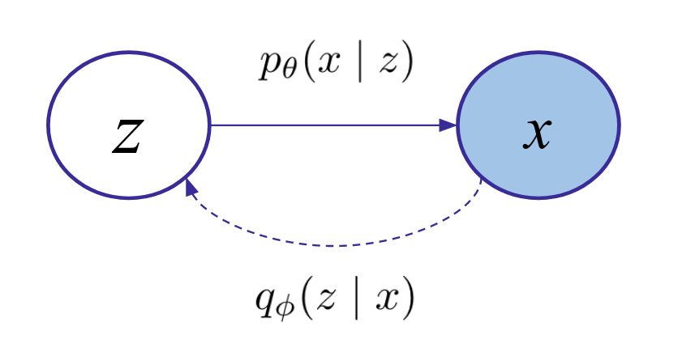

# Variational AutoEncoders
- [Variational AutoEncoder](#variational-autoencoder)
  - [Quick explanation](#quick-explanation)
  - [Long explanation](#long-explanation)

## Variational AutoEncoder

https://arxiv.org/abs/1312.6114

<!--
[make a diagram]
image -> encode -> z normal -> decode -> image
-->

### Quick explanation

The easiest way to understand VAEs is by analogy with vanilla autoencoders.
If you understand autoencoders, the only difference is that for VAEs, we want
to be able to sample new images that are similar to the ones in our dataset.
VAEs enable this by making the latent a z-distribution and not just a z-vector.
When we want new samples from our generative model, we can sample the z-distribution and get them.

This is a minor change (only a few lines) from the vanilla autoencoder.
Instead of a single latent vector, our network produces two latent vectors, one for the mean and one for the variance of a multivariate Normal distribution.
Additionally, we must add an extra KL divergence constraint between the z-dist and a standard Normal distribution,
so that our network doesn't just collapse to the standard autoencoder, and instead uses the full space and let's
us generate samples by just sampling from a standard Normal.

### Long explanation

<!--[make a better diagram, with encoder, decoder, prior]-->

TODO

<!--
VAEs assume a structured probabilistic graphical model for how the data was generated.
We assume that there are latent properties of the world, z, that are the underlying cause of the data x.
So for example, our latent could specify there is a duck floating on a pond, along with the attributes of the image like lighting and camera angle and zoom. 
And then by some probabilistic process, these latent variables lead to the image data we see.

For our purposes, we care about training a network or networks to model the density p_{\text{data}}(x), so we can sample from it and get new images.
To train our network, we need a function that we can evaluate and use as our loss to run SGD on.
Given our graphical model, we start by writing p(x) as:

We are going to make the choice to model p(z)

First off, we are going to make the choice to model p(x|z) as a neural network that takes a latent
vector of size 128, let's say, and outputs the distribution for an image---for binary MNIST let's say
we use a Bernoulli distribution: for every pixel in the 28x28 image, the model outputs a probability that that pixel is white vs. black.
And we are going to make the the choice that p(z) is some distribution that is easy to sample from, so we set it as a Normal distribution.

Now the equation above says that we have to evaluate this over all possible values of z.
How do all the possible latents contribute mass to the probabilty of an image? 

If we imagine z as a continuous latent vector, some parts of z will represent water maybe and some will represent ducks.
And this value might lead us to producing more of the pixels in the image correctly.
Like if we randomly sample a latent and it happens to be about ducks, then p(x|z) would be high.
The issue with this is that if z is either high-dimensional or continuous, this is intractable to do.
We can't evaluate the network on all possible z's, and you can run continuous integrals over neural network evaluations.
We can use the trick of evalute this using an [expectation](https://en.wikipedia.org/wiki/Expected_value#Absolutely_continuous_case), by sampling over K
different values of z and averaging the results:

The main issue with this is: imagine you are training a system this way by trying to reconstruct
individual data points; the odds that you sample the exact right latents that match that data point are very
slim, especially in high-dimensions. The z that corresponds with a duck on a pond is very unlikely
to be randomly drawed, so p(x|z) is going to close to 0 and very uninformative if that's your image data x.
So this ends up being a bad idea.

So intuitively, we face the challenge of how can we get a latent z that matches the image we are trying to construct?
If we want to use something like a Monte Carlo approach, how do we ensure that our model has laser focus.
Like is there a way we could ensure our monte carlo samples only correspond to latents that are likely to make good contributions.

We could use the posterior, which is given we had already observed the data, what would we
say is the latent. If we see a specific duck image, what we would say is the z that corresponds with it?
Using Bayes rule, and given the way the arrow points in our graphical model, there would be a way to analytically
compute the z that matches with a certain x. The posterior is: p(z|x) = p(x|z)/p(x) * p(z).
This tells you the exact z that matches the z. But this requires evaluating the density of p(x), which we can't do.
If z leads to x, but we have x and not z, this is how we compute it.

So what we're going to do is learn an encoder to map from x to z.
Then we get the one that matches. And we're going to train it end to end so this works well.
We are going to make to a normal so we can sample from it to smooth things out a bit and get better coverage.
And we are going to do the KL between this and the normal so then we can just sample from the normal completely to get new ones.

This is sometimes called a recognition network, [discussed in the IWAE paper](https://arxiv.org/abs/1509.00519),
which they point to the [Helmholtz machine](https://en.wikipedia.org/wiki/Helmholtz_machine) paper as the source.

Some further questions to consider are:
- VAE uses the reparameterization trick. What if we used the Likelihood Ratio / REINFORCE trick? Would it work well if combined with the standard?
- In what cases would we want multi-modal distributions?
-->

<!--
You would expect that the z is unimodal if there is only one x that explains it.
But if you have multiple possible latents that describe the same x, for example
if you expect that there are multiple paths to reach the same x point, then you probably
want a multi-modal distribution.

What if we did REINFORCE on the VAE loss? Is this even possible?

approx_post(x).log_prob(z) * decoder(z).log_prob(x)
where z comes from samples.

The first term is the log_prob score. The second term is like the Advantage which we are using to modulate the gradients.
Make the z more likely in proportion to how likely it made the x.

Maybe it helps. It seems pretty weak. Is it any less weak than REINFORCE gradient is?
Likelihood ratio gradient.

Though you should probably use the output probability, not log prob. Then you subtract 0.5 to center it.
Bada boom bada bing.

The advantage of this would be that you don't need to be differentiable.
The score function or the sampling process.

-->

## VQ-VAE

TODO: explanation. basically vae with discrete latent codes. the encoder and decoder are pretty standard, besides passing through the discretization.
you have to do some tricks to learn the prior so you can sample from it. usually you use an autoregressive model like pixelcnn which operates on the latent codes as if they were an image.